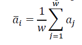
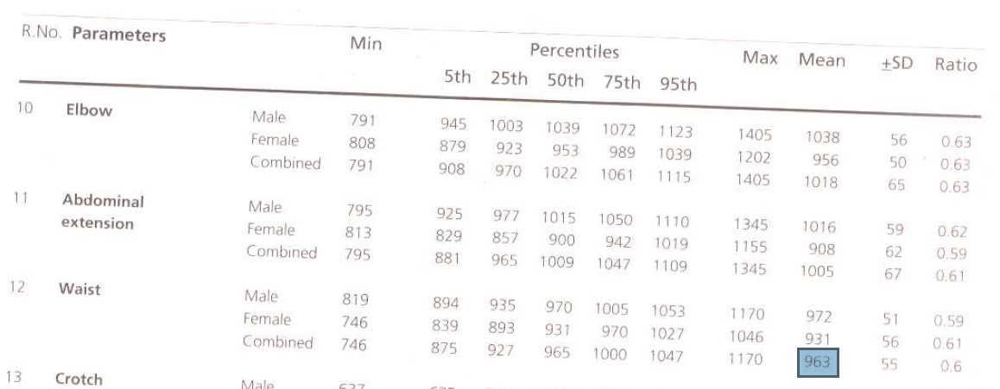

# **Step Counter and Stride Length measurement**

## ***Question***

### *Find out the distance covered from the seat. Note that the placement of the sensor is along with the neckband.*

## ***Answer***

#### Step Calculation
Algorithm to find the steps used is Sliding Window Averaging Technique (SWAT).

This proposed method computes the magnitude of acceleration ai using Eq (1). The local mean acceleration āi was then computed using the following equation



In this case, the mean was calculated for each sample using an overlapped sliding window averaging technique (SWAT). The averaging window size was fixed to 24 samples (due to sampling frequency being 119 Hz.) following the same rule as 0.2s interval. For this method, the user are asked to stand still at least 10 seconds before starting the walk. The alignment error and gravity were reduced from mean acceleration value by subtracting the mean value during this standing position as follows.


Step is dected using threshold of ```1.2 m/s^2``` and to avoid false prediction, for each detected steps any peak between next 0.30 seconds were discarded.

#### Stride Length

The most common approach to measure the average step length is to consider human gait as an inverted pendulum model. Based on this biomechanical model, Zijlstra et al proposed a relationship between the step length and the vertical displacement of the COM of human body.


#### Len legth calculations

Ref: Indian Anthropomatric dimension by D. Chakrabarti.




#### Pelvic COM displacement

```
Ref:
Saini, M., Kerrigan, D. C., Thirunarayan, M. A., & Duff-Raffaele, M. (1998). The Vertical Displacement of the Center of Mass During Walking: A Comparison of Four Measurement Methods. Journal of Biomechanical Engineering, 120(1), 133. doi:10.1115/1.2834293
```


## Code
```
#include <Arduino_LSM9DS1.h>

/* ----------------- Definations ------------------ */

#define THRESHOLD 1.2
#define BAUD_RATE 9600
#define WINDOW_SIZE 24

#define LEG_LENGTH 0.963 // length in m
#define VERTICAL_COM_DISP 0.0261 // length in m
#define FOOT_LEN 0.244 //length in m
#define PROP_CONST 0.83 //according to Han et al

#define FALSE_TIME 300 //time in ms

/* ----------------- Global Variations ------------------ */

// Acceleration
float Xaxis_accn;
float Yaxis_accn;
float Zaxis_accn;

float mag_of_acc;

float acc_buf[WINDOW_SIZE];

float local_mean_acc;

float stand_acc;

// index
int index1;

// Steps
int steps;
float step_length;

// timings
unsigned long prev_start_time;
unsigned long current_false_time;

/* ----------------- SETUP ------------------ */

void setup()
{
  Serial.begin(BAUD_RATE);
  while (!Serial)
    ; // wait till serial initialises
  Serial.println("Started.....");

  if (!IMU.begin())
  {
    Serial.println("FAILED TO INITIALISE IMU!!!!");
    while (1)
      ;
  }

  Serial.print("Acceralation Rate is = ");
  Serial.print(IMU.accelerationSampleRate());
  Serial.println(" Hz");
  Serial.println("Acceleration in m/s"); // Multiple IMU accelaration with '10'

  calibrate();

  // initialise buffer
  for (int i = 0; i < WINDOW_SIZE; i++)
  {
    acc_buf[i] = 0;
  }

  // initialise index
  index1 = 0;

  // intialise steps
  steps = 0;

  step_length = 0;

  // initialise time
  prev_start_time = millis();
  current_false_time = prev_start_time;
}

/* ----------------- LOOP ------------------ */

void loop()
{

  if (IMU.accelerationAvailable())
  {
    IMU.readAcceleration(Xaxis_accn, Yaxis_accn, Zaxis_accn);
    Xaxis_accn *= 10; // Convert to m/s
    Yaxis_accn *= 10; // Convert to m/s
    Zaxis_accn *= 10; // Convert to m/s

    mag_of_acc = sqrt((Xaxis_accn * Xaxis_accn) + (Yaxis_accn * Yaxis_accn) + (Zaxis_accn * Zaxis_accn));

    acc_buf[index1] = mag_of_acc / WINDOW_SIZE;

    local_mean_acc = 0;

    for (int i = 0; i < WINDOW_SIZE; i++)
    {
      local_mean_acc += acc_buf[i];
    }

    local_mean_acc -= stand_acc;

    current_false_time = millis();

    if ((local_mean_acc > THRESHOLD) && ((current_false_time - prev_start_time) > FALSE_TIME))
    {
      steps++;

      step_length = (2 * (sqrt((2 * VERTICAL_COM_DISP * LEG_LENGTH) - (sq(VERTICAL_COM_DISP))))) +  (PROP_CONST * FOOT_LEN);

      Serial.print("Steps = ");
      Serial.print(steps);
      Serial.print("\t");
      Serial.print("Distance Travelled = ");
      Serial.print(step_length * steps);
      Serial.println(" m");

      prev_start_time = current_false_time;
    }

    // increment and reset index
    index1 = (index1 + 1) % WINDOW_SIZE;
  }
}

/* ----------------- FUNCTIONS ------------------ */

void calibrate(void)
{
  float mean = 0;
  int mean_count = 0;
  int cal_index = 0;

  unsigned long start_time, curren_time;

  // initialise buffer
  for (int i = 0; i < WINDOW_SIZE; i++)
  {
    acc_buf[i] = 0;
  }

  Serial.println("Calibrating, Stand still for 10s..........");
  delay(1000);

  start_time = millis();
  curren_time = start_time;

  while ((curren_time - start_time) < 10000)
  {
    if (IMU.accelerationAvailable())
    {
      IMU.readAcceleration(Xaxis_accn, Yaxis_accn, Zaxis_accn);
      Xaxis_accn *= 10; // Convert to m/s
      Yaxis_accn *= 10; // Convert to m/s
      Zaxis_accn *= 10; // Convert to m/s

      mag_of_acc = sqrt((Xaxis_accn * Xaxis_accn) + (Yaxis_accn * Yaxis_accn) + (Zaxis_accn * Zaxis_accn));

      acc_buf[cal_index] = mag_of_acc / WINDOW_SIZE;

      stand_acc = 0;

      for (int i = 0; i < WINDOW_SIZE; i++)
      {
        stand_acc += acc_buf[i];
      }

      mean += stand_acc;
      mean_count++;

      // increment and reset index
      cal_index = (cal_index + 1) % WINDOW_SIZE;
    }

    curren_time = millis();
  }

  stand_acc = mean / mean_count;

  Serial.print("Mean standing acceleration = ");
  Serial.println(stand_acc);
  delay(1000);
  Serial.println("Start Walking.....");
}
```